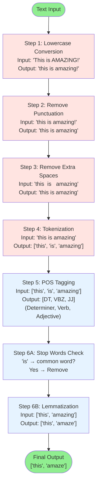
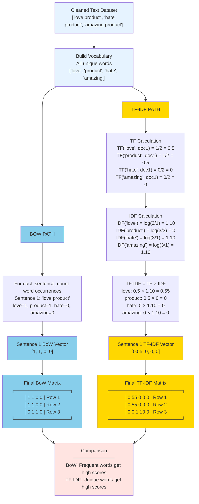
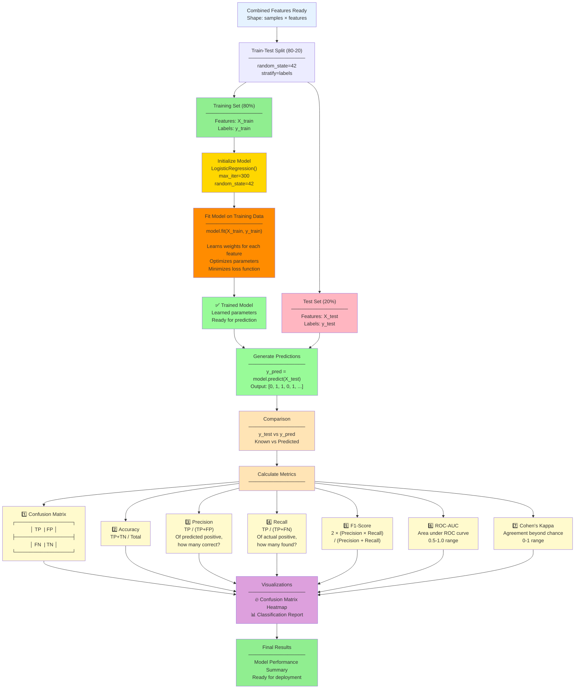

# TF-IDF Sentiment Analysis Pipeline

A complete machine learning pipeline for sentiment analysis using Bag of Words (BoW) and TF-IDF feature extraction combined with Logistic Regression classification.

---

## Project Overview

This project implements a **text sentiment classification system** with the following workflow:

```
Raw Data → Preprocessing → Feature Extraction → Model Training → Evaluation
```

---

## Step-by-Step Workflow

### **Step 1: Data Preprocessing** (`preprocess.py`)

**Purpose:** Clean and normalize raw text data for machine learning.

**Input:** `sentiment.csv` (raw sentiment data)

**Output:** `sentiment_cleaned.csv` (cleaned data)

**Processing Steps:**

1. **Load Data**: Read CSV file using pandas
2. **Convert to Lowercase**: Normalize text case for consistency
3. **Remove Punctuation**: Keep only letters and spaces using regex `[^a-z\s]`
4. **Remove Extra Spaces**: Clean up whitespace with `\s+` pattern
5. **Remove Stop Words**: Filter out common words like "the", "and", "is" that don't add meaning
6. **Tokenization**: Split text into individual words
7. **Part-of-Speech (POS) Tagging**: Identify word types (noun, verb, adjective, etc.)
8. **Lemmatization**: Reduce words to their base form
   - "running", "runs", "ran" → "run"
   - Uses `WordNetLemmatizer` with proper POS tags for accuracy

**Example:**

- Input: "This product is AMAZING! I really loved it!!!"
- Output: "product amazing love"

---

### **Step 2: Bag of Words (BoW)** (`bow.py`)

**Purpose:** Convert cleaned text into numerical feature vectors using word counts.

**Input:** `sentiment_cleaned.csv`

**Output:** BoW matrix (samples × vocabulary)

**How It Works:**

1. **Vectorization**: `CountVectorizer` creates a vocabulary from all words
2. **Counting**: For each sample, count occurrences of each word
3. **Sparse Matrix**: Store as sparse matrix for memory efficiency (many zero values)

**Example:**

```
Text: "love product amazing"

BoW Vector:
┌──────────┬─────────┬────────────┬───────┐
│ amazing  │ love    │ product    │ other │
├──────────┼─────────┼────────────┼───────┤
│ 1        │ 1       │ 1          │ 0     │
└──────────┴─────────┴────────────┴───────┘
```

**Output Shape:** (number_of_samples, vocabulary_size)

---

### **Step 3: TF-IDF Vectorization** (`ifidf.py`)

**Purpose:** Convert text to TF-IDF vectors, weighting words by importance.

**Input:** `sentiment_cleaned.csv`

**Output:** TF-IDF matrix (samples × vocabulary)

**Mathematical Concept:**

- **TF (Term Frequency)**: How often a word appears in a document
  $$TF = \frac{\text{count of word in document}}{\text{total words in document}}$$

- **IDF (Inverse Document Frequency)**: How unique a word is across all documents
  $$IDF = \log\left(\frac{\text{total documents}}{\text{documents containing word}}\right)$$

- **TF-IDF**: Product of TF and IDF
  $$TF\text{-}IDF = TF \times IDF$$

**Why Use TF-IDF?**

- Common words (stop words) get low scores
- Unique/important words get high scores
- Better for distinguishing between documents than raw counts

**Example:**

```
Common word "product" → low TF-IDF score (appears in many reviews)
Unique word "durable" → high TF-IDF score (distinguishes this review)
```

---

### **Step 4: Feature Concatenation** (`concate.py`)

**Purpose:** Combine BoW and TF-IDF features into a single feature matrix.

**Input:** `sentiment_cleaned.csv`

**Output:** Combined feature matrix (samples × [vocab_size + vocab_size])

**Process:**

1. Create BoW vectors from `CountVectorizer`
2. Create TF-IDF vectors from `TfidfVectorizer`
3. Horizontally stack both matrices using `hstack()`

**Example:**

```
BoW Features        TF-IDF Features      Combined Features
┌──────────────┐   ┌──────────────┐    ┌─────────────────────────────┐
│ [1, 2, 0...] │ + │ [0.5, 0.8...] │ = │ [1, 2, 0..., 0.5, 0.8...] │
└──────────────┘   └──────────────┘    └─────────────────────────────┘
```

**Benefit:** Combines both word frequency information AND word importance, giving the model more signal.

---

### **Step 5: Train-Test Split** (`split.py`)

**Purpose:** Divide data into training and testing sets for model evaluation.

**Input:** Combined features + labels

**Output:** `train_features`, `test_features`, `train_labels`, `test_labels`

**Process:**

1. **Test Size**: 20% of data reserved for testing (80/20 split)
2. **Stratification**: Ensure both train and test have same label distribution
   - Maintains class balance between train and test
3. **Random State**: Use `random_state=42` for reproducible splits

**Example:**

```
Original: 100 samples (60 positive, 40 negative)
Train: 80 samples (48 positive, 32 negative) - 80%
Test:  20 samples (12 positive, 8 negative)  - 20%
```

---

### **Step 6: Model Training** (`train_LR.py`)

**Purpose:** Train a Logistic Regression classifier on combined features.

**Input:** `train_features`, `train_labels`

**Output:** Trained model + predictions on test set

**Algorithm: Logistic Regression**

- **Classification Type**: Binary classification (for 2 labels) or multi-class
- **Algorithm**: Linear model with sigmoid function
  $$P(y=1) = \frac{1}{1 + e^{-z}}$$
  where $z$ is the linear combination of features

- **Parameters**:
  - `max_iter=300`: Maximum iterations for convergence
  - `random_state=42`: Reproducibility

**Training Process:**

1. Initialize model with `LogisticRegression()`
2. Fit model on training features and labels with `.fit()`
3. Predict on test set with `.predict()`

**Output:**

```
✅ Logistic Regression trained
Test labels:   [0, 1, 1, 0, 1, ...]
Predicted:     [0, 1, 0, 0, 1, ...]
```

---

### **Step 7: Model Evaluation** (`eval.py`)

**Purpose:** Comprehensive evaluation of model performance using multiple metrics.

**Input:** `test_labels`, `test_predictions`

**Output:** Performance metrics and visualizations

**Evaluation Metrics:**

1. **Confusion Matrix**: Shows TP, TN, FP, FN

   ```
                Predicted Positive | Predicted Negative
   Actual Positive:  True Positive  | False Negative
   Actual Negative:  False Positive | True Negative
   ```

2. **Accuracy**: Overall correctness
   $$\text{Accuracy} = \frac{TP + TN}{TP + TN + FP + FN}$$

3. **Precision**: Of predicted positive, how many are actually positive?
   $$\text{Precision} = \frac{TP}{TP + FP}$$

4. **Recall (Sensitivity)**: Of actual positive, how many did we find?
   $$\text{Recall} = \frac{TP}{TP + FN}$$

5. **F1-Score**: Harmonic mean of Precision and Recall
   $$F1 = 2 \times \frac{\text{Precision} \times \text{Recall}}{\text{Precision} + \text{Recall}}$$

6. **ROC-AUC**: Area under the ROC curve (0.5 to 1.0, higher is better)

7. **Cohen's Kappa**: Agreement beyond chance (0 to 1)

**Visualizations:**

- Confusion matrix heatmap
- Classification report table

---

## Complete Execution Flow

### **Running the Pipeline:**

```bash
# Step 1: Preprocess raw data
python preprocess.py
# Output: sentiment_cleaned.csv

# Step 2: View Bag of Words features
python bow.py
# Displays: BoW matrix and vocabulary

# Step 3: View TF-IDF features
python ifidf.py
# Displays: TF-IDF matrix and top terms

# Step 4: View combined features
python concate.py
# Displays: Combined BoW + TF-IDF matrix

# Step 5: Split data (optional, usually done inside train/eval)
python split.py
# Displays: Train/test split statistics

# Step 6: Train model
python train_LR.py
# Displays: Predictions on test set

# Step 7: Full evaluation
python eval.py
# Displays: All metrics and visualizations
```

### **Recommended Execution Order:**

1. **First Run**: `preprocess.py` → Generate cleaned data
2. **Exploration**: `bow.py`, `ifidf.py` → Understand feature representations
3. **Full Pipeline**: `eval.py` → Complete training, prediction, and evaluation

---

## Data Flow Diagram

```
sentiment.csv (raw data)
        ↓
  preprocess.py
        ↓
sentiment_cleaned.csv
        ↓
    ↙   ↓   ↘
  bow.py  ifidf.py  (feature exploration)
    ↘   ↓   ↙
  concate.py (combine features)
        ↓
  split.py (train-test split)
        ↓
  train_LR.py (train model)
        ↓
   eval.py (evaluate)
        ↓
Performance metrics & visualizations
```

---

## Complete Pipeline Flowchart

```mermaid
flowchart TD
    Start([Start]) --> Load["📁 Load sentiment.csv<br/>Raw sentiment data"]

    Load --> Preprocess["🔧 PREPROCESSING<br/>(preprocess.py)<br/>────────────────<br/>1. Convert to lowercase<br/>2. Remove punctuation<br/>3. Remove extra spaces<br/>4. Remove stop words<br/>5. POS tagging<br/>6. Lemmatization"]

    Preprocess --> CleanedData["✅ sentiment_cleaned.csv<br/>Cleaned & normalized text"]

    CleanedData --> Split_Features{{"Feature Extraction"}}

    Split_Features -->|Path 1| BoW["🎒 BAG OF WORDS<br/>(bow.py)<br/>────────────────<br/>CountVectorizer<br/>Word counts per sample"]

    Split_Features -->|Path 2| TFIDF["⚖️ TF-IDF VECTORIZATION<br/>(ifidf.py)<br/>────────────────<br/>TF = word frequency<br/>IDF = document uniqueness<br/>TF-IDF = TF × IDF"]

    BoW --> BoW_Output["📊 BoW Matrix<br/>Shape: samples × vocab_size<br/>Example: [1, 2, 0, 3, ...]"]
    TFIDF --> TFIDF_Output["📊 TF-IDF Matrix<br/>Shape: samples × vocab_size<br/>Example: [0.5, 0.8, 0, 0.9, ...]"]

    BoW_Output --> Concat["🔗 FEATURE CONCATENATION<br/>(concate.py)<br/>────────────────<br/>Horizontally stack:<br/>BoW features + TF-IDF features"]
    TFIDF_Output --> Concat

    Concat --> Combined["✅ Combined Features<br/>Shape: samples × vocab_size×2<br/>Example: [BoW values | TF-IDF values]"]

    Combined --> SplitData["✂️ TRAIN-TEST SPLIT<br/>(split.py)<br/>────────────────<br/>80% Training data<br/>20% Testing data<br/>Stratified split"]

    SplitData --> Train_Data["📚 Training Set<br/>80% samples<br/>Features + Labels"]
    SplitData --> Test_Data["🧪 Test Set<br/>20% samples<br/>Features + Labels"]

    Train_Data --> Train["🤖 MODEL TRAINING<br/>(train_LR.py)<br/>────────────────<br/>Algorithm: Logistic Regression<br/>Input: combined features + labels<br/>Output: trained classifier"]
    Test_Data --> Train

    Train --> Trained_Model["✅ Trained Model<br/>P(sentiment) = 1/(1+e^-z)<br/>max_iter=300"]

    Trained_Model --> Predict["🎯 PREDICTION<br/>Predict on test set<br/>Output: [0, 1, 1, 0, ...]"]

    Predict --> Pred_Results["🔮 Predictions<br/>Test predictions<br/>Predicted labels"]

    Pred_Results --> Eval["📊 EVALUATION<br/>(eval.py)<br/>────────────────<br/>1. Confusion Matrix<br/>2. Accuracy<br/>3. Precision<br/>4. Recall (Sensitivity)<br/>5. F1-Score<br/>6. ROC-AUC<br/>7. Cohen's Kappa"]

    Test_Data --> Eval

    Eval --> Results["📈 Results<br/>────────────────<br/>Confusion Matrix Heatmap<br/>Classification Report<br/>Performance Metrics<br/>Model Assessment"]

    Results --> End([End: Model Ready for Production])

    style Start fill:#90EE90
    style End fill:#90EE90
    style Preprocess fill:#FFB6C1
    style BoW fill:#87CEEB
    style TFIDF fill:#87CEEB
    style Concat fill:#FFD700
    style SplitData fill:#DDA0DD
    style Train fill:#FF8C00
    style Predict fill:#98FB98
    style Eval fill:#FFE4B5
    style CleanedData fill:#B0E0E6
    style Trained_Model fill:#FFDAB9
    style Results fill:#FFFACD
```



---

## Preprocessing Pipeline Flowchart



---

## Feature Extraction Comparison: BoW vs TF-IDF



---

## Model Training & Evaluation Flowchart



---

## Key Concepts Explained

### **Feature Engineering**

- **BoW**: Simple but effective, preserves word frequency information
- **TF-IDF**: More sophisticated, considers word importance
- **Combination**: Provides model with both frequency and importance signals

### **Why Preprocessing Matters**

- **Tokenization & Lemmatization**: "running", "runs" → "run" (reduces noise)
- **Stop Words Removal**: Removes uninformative common words
- **Lowercase & Punctuation Removal**: Standardizes input for consistent features

### **Why Train-Test Split?**

- **Prevents Overfitting**: Model shouldn't memorize training data
- **Realistic Evaluation**: Tests on unseen data like real-world usage
- **Stratification**: Maintains class distribution (important for imbalanced data)

### **Logistic Regression for Classification**

- **Pros**: Fast, interpretable, works well with high-dimensional sparse data
- **Output**: Probability scores (0 to 1) converted to class predictions
- **Suitable for**: Text classification, sentiment analysis

---

## File Summary

| File            | Purpose                    | Input                   | Output                     |
| --------------- | -------------------------- | ----------------------- | -------------------------- |
| `preprocess.py` | Clean & normalize text     | `sentiment.csv`         | `sentiment_cleaned.csv`    |
| `bow.py`        | Bag of Words vectorization | `sentiment_cleaned.csv` | BoW matrix (display)       |
| `ifidf.py`      | TF-IDF vectorization       | `sentiment_cleaned.csv` | TF-IDF matrix (display)    |
| `concate.py`    | Combine BoW + TF-IDF       | `sentiment_cleaned.csv` | Combined matrix (display)  |
| `split.py`      | Train-test split           | Combined features       | Split statistics (display) |
| `train_LR.py`   | Train classifier           | Combined features       | Model + predictions        |
| `eval.py`       | Complete evaluation        | Combined features       | Metrics + visualizations   |

---

## Requirements

Install dependencies:

```bash
pip install pandas scikit-learn nltk scipy matplotlib seaborn numpy
```

NLTK data (automatically downloaded by preprocess.py):

- wordnet
- omw-1.4
- averaged_perceptron_tagger_eng

---

## Expected Outcomes

- Sentiment classification with reasonable accuracy
- Interpretable model using standard ML techniques
- Visual performance metrics for model assessment
- Feature importance analysis through term analysis

---

## Notes

- **Random State**: Set to 42 for reproducibility across runs
- **Sparse Matrices**: Used for memory efficiency with high-dimensional text features
- **Feature Dimensions**: Grows with vocabulary size; typically 1000-5000 features per type
- **Model**: Logistic Regression chosen for interpretability and text classification effectiveness
